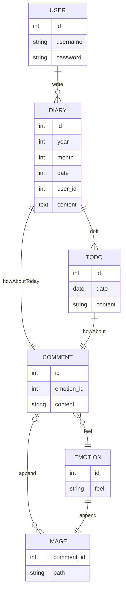

# [포스코x코딩온] 웹 풀스택 과정 7기 6주차 금요일 회고

- [\[포스코x코딩온\] 웹 풀스택 과정 7기 6주차 금요일 회고](#포스코x코딩온-웹-풀스택-과정-7기-6주차-금요일-회고)
  - [Cookie](#cookie)
    - [Express 에서 쿠키 사용](#express-에서-쿠키-사용)
  - [Session](#session)
    - [Express 에서 세션 사용](#express-에서-세션-사용)
      - [TS 사용 시 형식 오류](#ts-사용-시-형식-오류)
  - [2차 팀 프로젝트](#2차-팀-프로젝트)
    - [DB 설계](#db-설계)
    - [API 설계](#api-설계)
    - [현재 상황](#현재-상황)
      - [윈도우 환경](#윈도우-환경)
      - [Git 설정](#git-설정)

## Cookie

쿠키는 클라이언트 측에 저장하는 정보이다.  

### Express 에서 쿠키 사용

먼저 `cookie-parser` 모듈을 설치한다.  

```bash
npm i cookie-parser
```

그리고 서버 실행 파일에 `cookie-parser` 모듈을 실행한다.   

```ts
import Express from "express";
import cookieParser from "cookie-parser";

const app = Express();
app.use(cookieParser());
```

이후 쿠키를 설정하고 사용하는 방법은 다음과 같다.  

```ts
app.get("/<쿠키를 설정할 경로/", (req, res) => {
  res.cookie("<쿠키 이름>", "<쿠키 값>", { // 쿠키 옵션
    httpOnly, // 서버에서만 사용 가능, 클라이언트에서 쿠키 확인 불가
    secure, // boolean, https에서만 쿠키 사용(서버로 전송) 가능
    domain, // string, 쿠키를 사용할 도메인, 기본은 현재 도메인
    sameSite, // string 다른 도메인에서도 쿠키를 사용할 수 있다.
    maxAge, // number, 쿠키 만료 기간(ms)
    path, // string, 쿠키를 사용할 경로
  });
  res.send("쿠키 설정 완료");
});

app.get("/<쿠키를 사용할 경로/", (req, res) => {
  const <쿠키 이름> = req.cookies.<쿠키 이름>;
  res.send(`<쿠키 이름>: ${<쿠키 이름>}`);
});
```

## Session

세션은 서버 측에 저장하는 정보이다.  

### Express 에서 세션 사용

먼저 `express-session` 모듈을 설치한다.  

```bash
npm i express-session
```

그리고 서버 실행 파일에 `express-session` 모듈을 실행한다.   

```ts
import Express from "express";
import session from "express-session";

const app = Express();
app.use(session({
  secret, // 필수, 세션을 암호화 키
  resave, // 없으면 warn, boolean, 세션을 항상 저장할지 여부
  saveUninitialized, // 없으면 warn, boolean, 세션이 저장되기 전에 uninitialized 상태로 미리 만들어서 저장
}));
```

이후 세션을 설정하고 사용하는 방법은 다음과 같다.  

```ts
app.get("/<세션을 설정할 경로/", (req, res) => {
  req.session.["세션 키"] = "<세션 값>";
});

app.get("/<세션을 사용할 경로/", (req, res) => {
  const 세션키 = req.session.["세션 키"];
  res.send(`<세션 키>: ${세션키}`);
});
```

#### TS 사용 시 형식 오류

TS를 사용하면 `req.session`에 대한 형식 오류가 발생한다.  
따라서 형식을 조금 수정해줘야한다.  
`declare` 키워드를 이용해 `SessionData` 인터페이스를 다음과 같이 수정했다.  

```ts
declare module 'express-session' {
  interface SessionData {
    [key: string]: any; // 임시로 모든 키값을 설정했지만 웬만하면 사용하는 키 값만 따로 설정해주자.
  }
}
```

## 2차 팀 프로젝트

2차 팀 프로젝트를 시작했다.  
우리는 투두와 일기 기능이 합쳐진 앱을 만들기로 했다.  

### DB 설계



### API 설계

<table>
  <thead>
    <tr>
      <th>Path</th>
      <th>Method</th>
      <th>Params</th>
      <th>Data</th>
      <th>CRUD</th>
    </tr>
  </thead>
  <tbody>
    <tr>
      <td>/api/sky/<code>year</code>/<code>month</code></td>
      <td>GET</td>
      <td><code>year</code>, <code>month</code></td>
      <td><code>year</code>년 <code>month</code> 월 일기</td>
      <td>READS</td>
    </tr>
    <tr>
      <td rowspan="4">/api/sky/<code>year</code>/<code>month</code>/<code>day</code>/cloud</td>
      <td>GET</td>
      <td rowspan="6"><code>year</code>, <code>month</code>, <code>day</code></td>
      <td rowspan="4"><code>year</code>년 <code>month</code> 월 <code>day</code> 일 일기</td>
      <td>READ</td>
    </tr>
    <tr>
      <td>POST</td>
      <td>CREATE</td>
    </tr>
    <tr>
      <td>PUT</td>
      <td>UPDATE</td>
    </tr>
    <tr>
      <td>DELETE</td>
      <td>DELETE</td>
    </tr>
    <tr>
      <td rowspan="2">/api/sky/<code>year</code>/<code>month</code>/<code>day</code>/star</td>
      <td>GET</td>
      <td rowspan="2"><code>year</code>년 <code>month</code> 월 <code>day</code> 일 할 일</td>
      <td>READS</td>
    </tr>
    <tr>
      <td>POST</td>
      <td>CREATE</td>
    </tr>
    <tr>
      <td rowspan="2">/api/sky/<code>year</code>/<code>month</code>/<code>day</code>/star/<code>star_id</code></td>
      <td>PUT</td>
      <td rowspan="2"><code>year</code>, <code>month</code>, <code>day</code>, <code>star_id</code></td>
      <td rowspan="2"><code>year</code>년 <code>month</code> 월 <code>day</code> 일 할 일 <code>star_id</code></td>
      <td>UPDATE</td>
    </tr>
    <tr>
      <td>DELETE</td>
      <td>DELETE</td>
    </tr>
    <tr>
      <td rowspan="4">/api/sky/<code>year</code>/<code>month</code>/<code>day</code>/star/<code>star_id</code>/cloud</td>
      <td>GET</td>
      <td rowspan="4"><code>year</code>, <code>month</code>, <code>day</code>, <code>star_id</code></td>
      <td rowspan="4"><code>year</code>년 <code>month</code> 월 <code>day</code> 일 할 일 <code>star_id</code> 소감</td>
      <td>READ</td>
    </tr>
    <tr>
      <td>POST</td>
      <td>CREATE</td>
    </tr>
    <tr>
      <td>PUT</td>
      <td>UPDATE</td>
    </tr>
    <tr>
      <td>DELETE</td>
      <td>DELETE</td>
    </tr>
  </tbody>
</table>

### 현재 상황

DB 설계를 어느정도 완성했고, 필요한 부분이 생각날 때마다 팀원들과 소통을 통해 추가할 예정이다.  
API는 현재 로그인, 회원가입은 대영님이라는 팀원분이 작성중이시고, 나는 일기 CRU 까지 완성했다.  
다른 팀원 분들은 프론트 작업을 하고 계신다.  
1차 프로젝트 이후 백엔드를 배웠기 때문에 DB, API 부분에 조금 더 힘써줬으면 좋겠지만 팀원 분들은 프론트에 더 관심이 많으신 것 같다.  
추가로 수업시간에 배우진 않았지만 TypeScript를 적용하자고 설득하여 사용하게 되었다.  
아직까지 Node도 힘들어하시는 분도 계시기에, 내가 최대한 도와드릴려고 한다.  
많은 도움이 되었으면 좋겠다.  

#### 윈도우 환경

팀원 5명 중에 3명이 윈도우였는데, 이를 생각치 못하고 맥 기준으로 작업을 했다.  
덕분에 많은 일이 있었다...  
가장 큰 문제는 내가 프로젝트를 생성했는데, 윈도우에서 코드를 실행하니 프로젝트가 실행조차 되질 않았다.  
결론적으로는 수업 시 사용한 `pm2` 대신 `ts-node-dev` 를 이용하여 해결했다.  

#### Git 설정

다른 팀원 분들이 아직 Git에 대한 이해가 부족해서 Git 설정을 도와드렸다.  
하지만 내가 매번 도와드리기에는 내 몸은 하나 뿐이기에, GitHub Desktop 을 설치해 드리고 사용방법을 알려드렸다.  
fork 뜨는 법부터 PR 하는 법까지 최대한 알려드릴려고 노력했다.  
사실 Git은 말 그대로 협업툴이기에 이런 팀 프로젝트가 없으면 사용법을 익히기 힘들 수 밖에 없다.  
나도 이런 팀 프로젝트를 참여하려고 부트캠프를 듣고 있기에, 팀원 분들이 Git을 잘 사용할 수 있도록 도와드리는 것도 나의 몫이라고 생각한다.  
많은 것을 배워가셨으면 좋겠다.  
