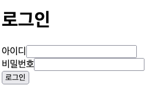

# [포스코x코딩온] 웹 풀스택 과정 7기 12주차 목요일 회고

- [\[포스코x코딩온\] 웹 풀스택 과정 7기 12주차 목요일 회고](#포스코x코딩온-웹-풀스택-과정-7기-12주차-목요일-회고)
  - [FE](#fe)
  - [Next.js](#nextjs)
  - [API 연결](#api-연결)
  - [Material UI](#material-ui)

## FE

이번 주는 FE 구현과 API 연결에 집중했다.

## Next.js

Next.js 는 React 의 SSR(Server Side Rendering) 을 지원하는 프레임워크이다.  
다만 우리가 구현할 프로젝트는 SSR 이 많이 필요하지 않았다.  
그럼에도 디렉토리 기반 라우팅, URL 마스킹 등의 기능을 사용하기 위해 Next.js 를 사용했다.  

## API 연결

팀원 분이 FE 페이지를 일부 구현해주셨지만 API 연결이 되지 않아서, API 연결을 진행했다.  
먼저 팀원분이 사용하시던 더미 데이터를 모두 지우고 API를 통해 데이터를 받아오도록 했다.  
예를 들어 로그인 페이지는 이런 식으로 수정했다.
그리고 API 를 보내기 위한 타입을 생성했다.
```typescript
interface LoginForm {
  username: string;
  password: string;
}
```
이후 로그인 실패 시 모달을 띄우기 위해 HTMLDialogElement 를 사용했다.
```jsx
<dialog onClick={(e) => e.currentTarget.close()} id="failed">
  <p>로그인 실패</p>
</dialog>
```

이후 로그인 폼 제출 이벤트 핸들러 생성 함수를 정의했다.
```typescript
function onFormSubmit(
  form: LoginForm,
  replace: (path: string) => void
): React.FormEventHandler<HTMLFormElement> {
  return async (e) => {
    e.preventDefault();
    console.log(form);
    const res = await fetch("/api/login", {
      method: "POST",
      headers: { "Content-Type": "application/json" },
      body: JSON.stringify(form),
    });
    if (res.ok) {
      const { access } = await res.json();
      localStorage.setItem("access", access); // TODO: 쿠키로 바꾸기
      replace("/");
    } else {
      console.log(res);
      (e.currentTarget ?? e.target)
        .querySelector<HTMLDialogElement>("#failed")
        ?.showModal();
    }
  };
}

```

마지막으로 컴포넌트 내에서 로그인 폼 제출 이벤트 핸들러를 생성해 form 태그에 등록했다.
```tsx
  const handleFormSubmit = useCallback(
    (e: React.FormEvent<HTMLFormElement>) => onFormSubmit(form, replace)(e),
    [form, replace]
  );
  ...
   <form onSubmit={handleFormSubmit}>
  ...
```

## Material UI

Material UI 는 구글의 Material Design 을 기반으로 한 UI 라이브러리이다.  
시험삼아 로그인/회원가입 페이지에 적용해 보았는데 생각보다 예쁘게 나와서 바로 적용했다.  




단 몇 분만에 그럴 듯한 UI 를 구현할 수 있었다.

