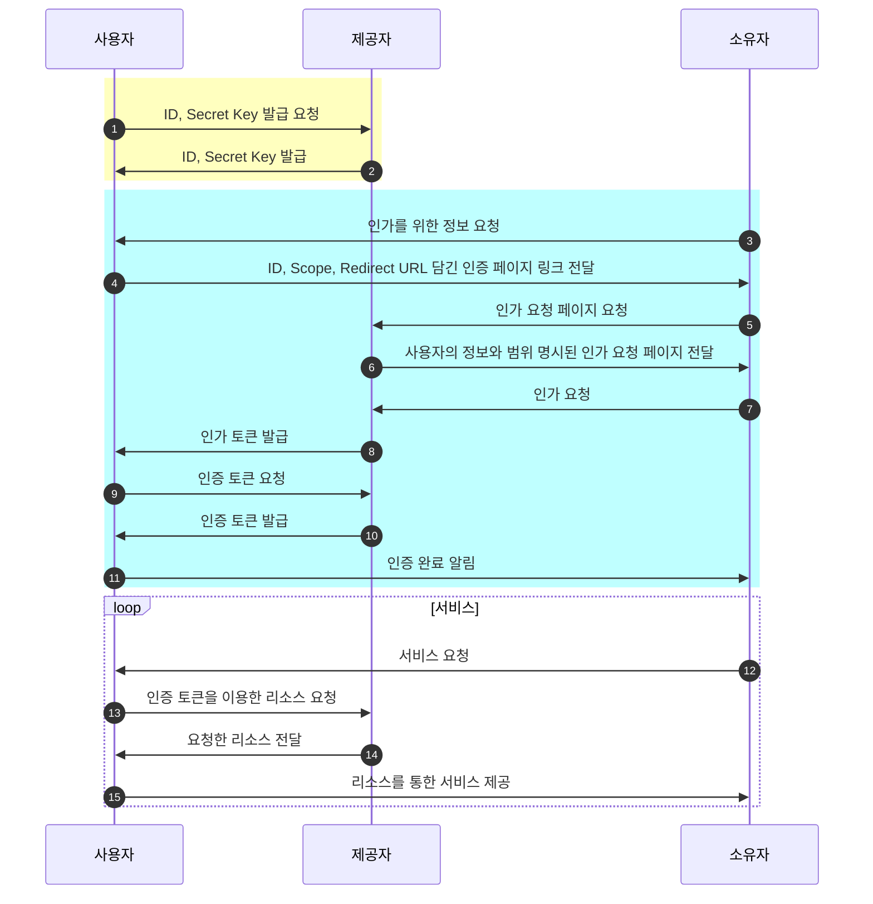

# 11월 09일 원티드 프리온보딩 백엔드 14일차 TIL

- [11월 09일 원티드 프리온보딩 백엔드 14일차 TIL](#11월-09일-원티드-프리온보딩-백엔드-14일차-til)
  - [1️⃣ 진행상황](#1️⃣진행상황)
  - [2️⃣ 진행상황리뷰](#2️⃣진행상황리뷰)
  - [3️⃣ Today I Learned](#3️⃣today-i-learned)
    - [migration 파일](#migration-파일)
    - [OAuth](#oauth)

## 1️⃣ 진행상황

- 하수 데이터와 강수 데이터를 연계하기 위한 구 모델 생성

## 2️⃣ 진행상황리뷰

```python
# data/models.py

class Gu(models.Model):
    name = models.CharField(max_length=8, verbose_name="구청명", unique=True)
    code = models.SmallIntegerField(verbose_name="구청 코드", unique=True, null=True)
    gubn = models.CharField(max_length=2, verbose_name="구분코드", unique=True, null=True)

class Sewer(models.Model):
    ...
    gu = models.ForeignKey(Gu, on_delete=models.CASCADE, verbose_name="구청")
...
class Rainguage(models.Model):
    ...
    gu = models.ForeignKey(Gu, on_delete=models.CASCADE, verbose_name="구청")

```
- 하수관, 강수량 모델을 연계시키기 위하여 구 모델 생성


## 3️⃣ Today I Learned

### migration 파일

구 모델을 생성하고 평소와 같이 `migrate`를 진행하려 하였으나 다음과 같은 오류가 발생하였다.
```bash
Running migrations:
  Applying < migration 파일 > Traceback (most recent call last):
  File "< Python 설치 디렉토리 >/site-packages/django/db/models/fields/__init__.py", line 2018, in get_prep_value
    return int(value)
ValueError: invalid literal for int() with base 10: ' '

The above exception was the direct cause of the following exception:

Traceback (most recent call last):
  File "< 프로젝트 디렉토리 >/manage.py", line 22, in <module>
    main()
  File "< 프로젝트 디렉토리 >/manage.py", line 18, in main
    execute_from_command_line(sys.argv)
  File "< Python 설치 디렉토리 >/site-packages/django/core/management/__init__.py", line 446, in execute_from_command_line
    utility.execute()
  File "< Python 설치 디렉토리 >/site-packages/django/core/management/__init__.py", line 440, in execute
    self.fetch_command(subcommand).run_from_argv(self.argv)
  File "< Python 설치 디렉토리 >/site-packages/django/core/management/base.py", line 402, in run_from_argv
    self.execute(*args, **cmd_options)
  File "< Python 설치 디렉토리 >/site-packages/django/core/management/base.py", line 448, in execute
    output = self.handle(*args, **options)
  File "< Python 설치 디렉토리 >/site-packages/django/core/management/base.py", line 96, in wrapped
    res = handle_func(*args, **kwargs)
  File "< Python 설치 디렉토리 >/site-packages/django/core/management/commands/migrate.py", line 349, in handle
    post_migrate_state = executor.migrate(
  File "< Python 설치 디렉토리 >/site-packages/django/db/migrations/executor.py", line 135, in migrate
    state = self._migrate_all_forwards(
  File "< Python 설치 디렉토리 >/site-packages/django/db/migrations/executor.py", line 167, in _migrate_all_forwards
    state = self.apply_migration(
  File "< Python 설치 디렉토리 >/site-packages/django/db/migrations/executor.py", line 252, in apply_migration
    state = migration.apply(state, schema_editor)
  File "< Python 설치 디렉토리 >/site-packages/django/db/migrations/migration.py", line 130, in apply
    operation.database_forwards(
  File "< Python 설치 디렉토리 >/site-packages/django/db/migrations/operations/fields.py", line 235, in database_forwards
    schema_editor.alter_field(from_model, from_field, to_field)
  File "< Python 설치 디렉토리 >/site-packages/django/db/backends/sqlite3/schema.py", line 174, in alter_field
    super().alter_field(model, old_field, new_field, strict=strict)
  File "< Python 설치 디렉토리 >/site-packages/django/db/backends/base/schema.py", line 788, in alter_field
    self._alter_field(
  File "< Python 설치 디렉토리 >/site-packages/django/db/backends/sqlite3/schema.py", line 457, in _alter_field
    self._remake_table(model, alter_field=(old_field, new_field))
  File "< Python 설치 디렉토리 >/site-packages/django/db/backends/sqlite3/schema.py", line 248, in _remake_table
    "default": self.prepare_default(self.effective_default(new_field)),
  File "< Python 설치 디렉토리 >/site-packages/django/db/backends/base/schema.py", line 425, in effective_default
    return field.get_db_prep_save(self._effective_default(field), self.connection)
  File "< Python 설치 디렉토리 >/site-packages/django/db/models/fields/related.py", line 1146, in get_db_prep_save
    return self.target_field.get_db_prep_save(value, connection=connection)
  File "< Python 설치 디렉토리 >/site-packages/django/db/models/fields/__init__.py", line 925, in get_db_prep_save
    return self.get_db_prep_value(value, connection=connection, prepared=False)
  File "< Python 설치 디렉토리 >/site-packages/django/db/models/fields/__init__.py", line 2703, in get_db_prep_value
    value = self.get_prep_value(value)
  File "< Python 설치 디렉토리 >/site-packages/django/db/models/fields/__init__.py", line 2020, in get_prep_value
    raise e.__class__(
ValueError: Field 'id' expected a number but got ' '.
```
`id` 값에 숫자가 아닌 문자열이 들어갔다는 에러였다.  
구 모델을 참조하는 다른 모델에서 해당 필드를 `null` 값이 불가능하게 변경했다.  
이 때문에 `makemigrations` 진행 시, 기본 값을 요청했다.  
이때 기본 값을 `' '`로 설정했는데, 이로 인한 문제였던 것 같다.  
이걸 어떻게 고치나 고민을 했는데, 결국 `migrations` 파일 어딘가에 해당 설정이 적혀 있지 않을까 해서 해당 파일을 열어봤다.  
파일 속에는 다음과 같은 내용이 있었다.
```python
...
migrations.AlterField(
    model_name="< 참조 모델 >",
    name="< 참조 모델의 필드 >",
    field=models.ForeignKey(
        default=' ',
        to="< 피참조 모델 >",
        ...
    ),
    preserve_default=False,
),
...
```
`default` 값이 `' '`로 설정되어 있었다.  
그래서 해당 값을 적당한 정수값으로 변경했다. (이번 경우는 구 모델에 총 25개의 레코드가 있어 `26`으로 설정했다.)  
다시 `migrate`를 진행하니 문제없이 마이그레이션이 완료되었다.  

### OAuth

OAuth는 인증을 위한 프로토콜로써, 리소스 소유자가 비밀번호 등을 제공하지 않고도 다른 클라이언트에게 서비스 제공자의 리소스의 사용을 인가하는 방식이다.  
주로 어떤 서비스를 사용할 때 SNS, 구글, 네이버 등의 계정을 통해 로그인할 때 사용된다.

OAuth에서는 소유자(Resource Owner), 사용자(Client), 제공자(Authorization Server) 총 3가지 역할이 필요하다.  
오해가 있을 수 있기에 미리 적어두자면, 여기서 사용자는 '실 서비스 사용자'가 아닌 **리소스를 사용**하는, 즉 서비스 제공자를 뜻한다.  
예를 들어 어떤 사람이 구글 계정을 통해 트위터를 로그인할 경우, 소유자는 사람, 사용자는 트위터, 제공자는 구글이다.
> 소유자 = 서비스 사용자 (보통 사람 개개인)  
> 사용자 = 서비스 제공자 (보통 회사, 앱, 서비스 등)  
> 제공자 = 서비스 사용자의 정보를 제공하고 인증하는 역할 (보통 구글, 네이버 등 큰 회사)

사용자(Client)는 먼저 제공자(Service Provider)에게 자신을 등록하여 ID와 Secret Key를 발급받는다.  
이후 소유자(Resource Owner)가 사용자에게 자신의 정보 인가를 요청하면, 사용자는 ID, 리소스 사용 범위(Scope), 인가 토큰을 전달할 리다이렉트 URL이 담긴 제공자의 인증 서버 페이지 링크를 소유자에게 전달한다.  
해당 페이지에서 제공자는 소유자에게 사용자의 정보와 사용 범위를 명시한다.  
소유자는 제공자의 인증 페이지에서 사용자의 정보와 범위를 확인한 후, 제공자에게 인가를 요청한다.  
제공자는 소유자에게 인가 토큰을 발급하여 사용자에게 전달한다.  
사용자는 소유자에게 전달받은 인가 토큰을 통해 제공자의 인증 서버에 인증 토큰을 요청한다.  
인증 토큰을 발급받은 사용자는 인증 토큰을 이용해 제공자의 리소스 서버에 리소스를 요청한다.  





참고
 - [OAuth 프로토콜의 이해와 활용 2 - OAuth란 무엇인가?](https://gdtbgl93.tistory.com/180)
